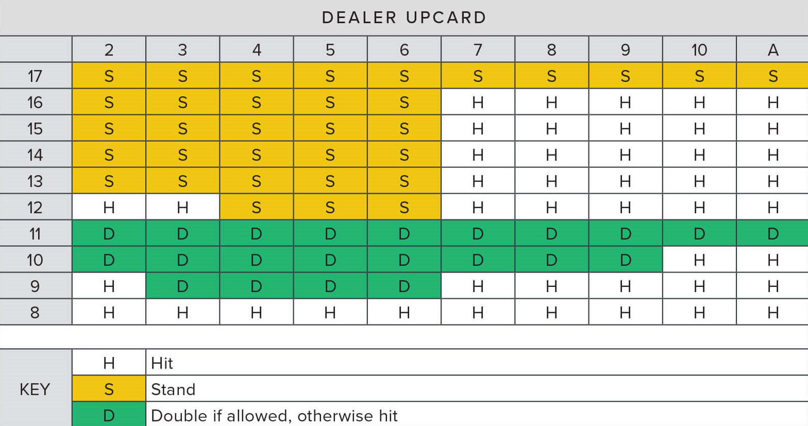

```{r setup, include=FALSE}
knitr::opts_chunk$set(echo = TRUE)
library(tidyverse)
library(dplyr)
library(ggplot2)
library(patchwork)
library(TTR)
library(cowplot)
library(png)
theme_set(theme_cowplot())
```

# Introduction

  Blackjack is known around the world as a timeless casino game. The rules are fairly simple, but the depth is shocking. Someone can play for years and still not have seen all the possibilities at a table. However, just like any other card game, basic probabilities can be calculated, and therefore an optimal strategy can be determined. In this analysis, I hope to showcase my data science skill by visualizing blackjack, and its infinite probabilities. Additionally, I hope to provide reasoning for why blackjack is played with a predetermined strategy. 

## Core Questions

1. What is the expected value of a blackjack hand?
2. How do the cards on the table influence the probability of a player winning?
3. Considering the conditional probabilities what decision should the player make?

```{r, warning=FALSE, message=FALSE}
dat1 <- read_csv("data/blkjckhands.csv") 
```


# Exploratory Data Analysis 

```{r}
glimpse(dat1)
```
 
  For this project, I am examining a dataset that contains 90,000 blackjack hands with 6 players per hand. The data is stored in the blkjckhands.csv and it was downloaded from a repository on Kaggle that is linked below. The data consists of 898,078 observations of 21 variables. The variables X1 and PlayerNo describe the 6 players present in each hand, they are dbl numeric and a character string respectively. The variables: card1, card2, card3, card4, card5, dealcard1, dealcard2, dealcard3, dealcard4, and dealcard5 describe the numeric value of the card dealt. The number at the end of the variable name corresponds to which card was dealt first in the sequence. If no card is dealt 0 takes the place of NA. Variables sumofcards and sumofdeal are numeric values which total to the value of the cards dealt to each player and the dealer, per hand, respectively. Blkjck is a simple character string with two unique values nowin and win. Winloss describes each players outcome simplistically per hand. Character strings Loss and Win are the two options. Variables plybustbeat and dlbustbeat describe the hand outcome in more detail with unique values Beat, Plwin, Bust, DlBust, and Push for plybustbeat with Dlwin, Beat, PlBust, Bust, and Push for dlbustbeat. Each of these variables are of class character. Plwinamt and dlwinamt describe the hand outcome monetarily. These values are numeric and a base bet of $10 is assumed for each player each hand. The final variable play2cardsum is interesting. It describes the starting position from which players will make their decisions.

```{r, warning = FALSE}
summary(dat1$ply2cardsum)

ggplot(dat1, aes(ply2cardsum)) +
  geom_bar() +
  labs(title = "Frequency of Player Starting Hands",
       x = "Player 2 Card Sum",
       y = "Frequency") +
  scale_x_discrete(limit = 2:21, breaks = 2:21)
```

```{r, warning = FALSE}
summary(dat1$card1)

ggplot(dat1, aes(card1)) +
  geom_bar() +
  labs(title = "Frequency of Player Card 1",
       x = "Player Card 1",
       y = "Frequency") +
  scale_x_discrete(limit = 1:11, breaks = 1:11)
```

```{r, warning = FALSE}
summary(dat1$dealcard2)

ggplot(dat1, aes(dealcard2)) +
  geom_bar() +
  labs(title = "Frequency of Dealer Card 2",
       x = "Dealer Card 2",
       y = "Frequency") +
  scale_x_discrete(limit = 1:11, breaks = 1:11)
```

```{r, warning = FALSE}
summary(dat1$sumofdeal)

ggplot(dat1, aes(sumofdeal)) +
  geom_bar() +
  labs(title = "Frequency of Dealer Card Sum",
       x = "Dealer Card Sum",
       y = "Frequency") +
  scale_x_discrete(limits = 8:26, breaks = 8:26)
```

```{r, warning=FALSE}
summary(dat1$sumofcards)

ggplot(dat1, aes(sumofcards)) +
  geom_bar() +
  labs(title = "Frequency of Player Card Sum",
       x = "Player Card Sum",
       y = "Frequency") +
  scale_x_discrete(limits = 8:26, breaks = 8:26)
```

```{r}
summary(dat1$plwinamt)
```

```{r}
summary(dat1$dlwinamt)
```
  
  In a blackjack game -- like the one being analyzed -- each player receives two cards. Possible values range from 1-11 for each card, and 2-21 for the total hand value. (An ace can be played with a value of 1 or 11.) The dealer is also dealt two cards, however one is face down. This forces the player to make a decision based on limited information. The player must choose to hit or stand.* All while playing against the dealer who has a hidden card. Another catch is that the dealer must stand on any 17. The object of the game is to beat the dealer by gaining a hand valued higher than theirs without exceeding 21. Above, I have calculated the summary statistics for important values. The values included will be the basis for my analysis. 
  The most important decision a player must make is to hit or stand. Seasoned blackjack players abide by a strategy known as "The Book"; which tells them when to do what. My analysis will uncover the book through calculation of a wide probability spectrum. First, I will show how blackjack is similar to all other casino games. Then, I will examine how the cards players and dealers receive influence the chances of a player winning. Finally, by combining these and earlier calculations I will effectively describe blackjack strategy. 

*Other options that I won't dive into for purposes of this analysis: double down, split.


# Data Analysis


## Question 1

__What is the expected value of a blackjack hand?__

  Expected value is a very useful tool for determining the underlying value in a game or market. Blackjack is no different. To calculate expected value multiply the monetary win/loss by the chance that thing happens. Then add up all the individual values to determine your expected value for the game. Below I have calculated the expected value of this blackjack data. 
```{r}
# percent chance dealer bust
# percent chance of plwin
windat <- dat1 %>%
  filter(plwinamt == 20) %>%
  summarise(win_count = n()) 

totl_dat <- dat1 %>%
  summarise(totl_count = n())

win_pct <- max(windat$win_count) / max(totl_dat$totl_count)
win_pct
```

Above is the chance a player wins, without getting a blackjack. 

```{r}
# percent chance of plpush
pushdat <- dat1 %>%
  filter(plwinamt == 10) %>%
  summarise(push_count = n()) 

totl_dat <- dat1 %>%
  summarise(totl_count = n())

push_pct <- max(pushdat$push_count) / max(totl_dat$totl_count)
push_pct
```

The percent chance of a push is shown above. 

```{r}
# percent chance of plloss
lossdat <- dat1 %>%
  filter(plwinamt == 0) %>%
  summarise(loss_count = n()) 

totl_dat <- dat1 %>%
  summarise(totl_count = n())

loss_pct <- max(lossdat$loss_count) / max(totl_dat$totl_count)
loss_pct
```

The percent chance of a loss is shown above.

```{r}
# pct chance of blackjack if win 
blkjckdat <- dat1 %>%
  filter(plwinamt == 25) %>%
  summarise(blkjck_count = n()) 

blkjck_true_pct <- max(blkjckdat$blkjck_count) / max(totl_dat$totl_count)
blkjck_true_pct
```

The chance a player wins, while also receiving a blackjack.

```{r}
# calculate expected value
ex1 <- 15 * blkjck_true_pct
ex2 <- 10 * win_pct
ex3 <- -10 * loss_pct
ex4 <- 0 * push_pct

EV <- ex1 + ex2 +ex3 + ex4
EV
```

  By combining the probabilities listed, I calculated the true expected value of this blackjack game. The output represents what a player stands to lose on average each hand. This is assuming the player bets $10 each time. A win is payed out 1:1 and blackjacks are payed out 3:2. 
  The negative expected value means that blackjack is an unfair game. In the long run you will lose, just like any other casino game. 

```{r}
true_win_pct <- blkjck_true_pct + win_pct 
house_edge_pct <- loss_pct - true_win_pct 
house_edge_pct
```

  When the the probability of a push is excluded the house edge can be easily calculated. This above chunk calculates the house edge to be just under 5 percent. This is due to the power of the dealer's predetermined strategy. The player is much more exposed. I will explore what this means, and how it influences overall strategy later. 


## Question 2

__How do the cards on the table influence the probability of a player winning?__

```{r, warning=FALSE}
x1 <- c(20, 25)

plhand_count <- dat1 %>%
  group_by(ply2cardsum) %>%
  summarise(count = n(), .groups = "keep")
  
plhand_win <- dat1 %>%
  group_by(ply2cardsum) %>%
  filter(plwinamt %in% x1) %>%
  summarise(win_count = n(), .groups = "keep")

plwin_pct <- plhand_count %>%
  left_join(plhand_win) %>%
  summarise(percent_win = win_count / count, .groups = "keep")

plot1 <- ggplot(plwin_pct, aes(ply2cardsum, percent_win * 100, fill = percent_win)) +
  geom_bar(stat = "identity") +
  labs(title = "Chance of Win vs. 2 Card Sum", 
       x = "Player 2 Card Sum",
       y = "Player Win Percentage") +
  scale_x_discrete(limits = (2:21), breaks = 1:21) +
  scale_fill_binned(low = "dimgray", high = "firebrick") +
  geom_hline(yintercept = 50)
plot1
```

  Here we see that out of 19 possible starting card sums the player is only favored to win in about 5 scenarios. The 19, 20, and 21 are self explanatory, however, the 10 and 11 are interesting. A player's probability is relatively good when starting with the 10 and 11. This can be explained by examining card value frequency explored in the EDA. Being dealt a card with a value of 10 is by far the most likely, therefore your chances of a high value hand are pretty good. 

```{r,warning=FALSE}
x1 <- c(20, 25)

plhand_count_sum <- dat1 %>%
  group_by(sumofcards) %>%
  summarise(count = n(), .groups = "keep")
  
plhand_win_sum <- dat1 %>%
  group_by(sumofcards) %>%
  filter(plwinamt %in% x1) %>%
  summarise(win_count = n(), .groups = "keep")

plwin_pct_sum <- plhand_count_sum %>%
  left_join(plhand_win_sum, by = "sumofcards") %>%
  summarise(percent_win = win_count / count, .groups = "keep")

plot2 <- ggplot(plwin_pct_sum, 
                aes(sumofcards, percent_win * 100, fill = percent_win)) +
  geom_bar(stat = "identity") +
  labs(title = "Chance of Win vs. 2 Card Sum", 
       x = "Player 2 Card Sum",
       y = "Player Win Percentage") +
  scale_x_discrete(breaks = 9:21) +
  scale_fill_binned(low = "dimgray", high = "firebrick") +
  geom_hline(yintercept = 50) +
  theme(legend.title = element_blank())
plot2

```

  From this distribution we can see that a player's primary goal should be to obtain a card sum greater than 17. Players are only favored in 3 of 12 possibilities. Considering the probability cliff, a player should hit on any card sum value less than 17. The player should not hit on the 17 because their chances of busting are far higher than obtaining a good hand. Additionally, a player's chance of a push are very good when holding a 17. 

```{r}
x2 <- c(2, 3, 4, 5, 6, 7, 8, 9, 10)

dl_count <- dat1 %>%
  group_by(dealcard2) %>%
  summarise(count = n(), .groups = "keep")

dl_bust_sum <- dat1 %>%
  group_by(dealcard2) %>%
  filter(dlbustbeat == "Bust", dealcard2 %in% x2) %>%
  summarise(bust_count = n(),  .groups = "keep")

dl_bust_pct <- dl_bust_sum %>%
  left_join(dl_count, by = "dealcard2") %>%
  summarise(percent_win = bust_count / count, .groups = "keep")

plot3 <- ggplot(dl_bust_pct, aes(dealcard2, percent_win * 100, fill = percent_win)) +
  geom_bar(stat = "identity") +
  labs(title = "Dealer Bust Probability By Face Up Card", x = "Dealer Face Up Card", y = "Bust Percentage") +
  scale_x_continuous(breaks = 2:10) +
  scale_fill_binned(low = "dimgray", high = "firebrick") +
  theme(legend.title = element_blank())
plot3
```

  A bust occurs when the card value sum is greater than 21, and the result is an automatic loss. Therefore, the probability of a dealer bust, given their face up card, is the second most important factor when considering a player's action in a blackjack hand. (Their starting card sum being the most important.) If the dealer is showing a 2 to 6 then the player should consider staying if their hand value is greater than 11 but less than 17. The dealer has over a 30% chance of an automatic loss here, which is higher than your percent win chance for some of those 12-16 starting hands. The chance of winning by a dealer bust is therefore greater than their chance of winning outright. So, if the player is attempting to maximize their value they would stay on these hands. 
  
  If a player bases their decision solely off their card value sum they would be playing a sub optimal hand. This is when "The Book" really starts to appear. 


## Question 3

__Considering the conditional probabilities what decision should the player make?__



  Based upon all of the probabilities explored above this is the computed optimal strategy, very similar to "The Book". The table is a wealth of information and can guide a player through any blackjack situation. This is the best way to play the game, and will net a player the greatest possible profit. (Doubling Down means a player doubles their bet, but they only get one more card.) There are other probabilities to consider, however, this is fairly comprehensive for the purpose of this analysis. 
  
  
# Conclusion 

  Blackjack is an unfair game. However, the promise of excitement and potential profits lures millions of players around the world. You can win in blackjack, but it entirely due to luck. The luck of the draw. In this analysis, I have shown when a player is predicted to win, and how to maximize a player's chance of winning. Do what you will with this information. Gamble responsibly! 
  
  P.S. One more bit of advice: If you get up get out! You will lose in the long run. 

# Data Weaknesses 

  One of the weaknesses I encountered in the data was lack of game progression knowledge. I assumed that dealcard2 was the dealer face up card, but it was never explicitly mentioned. Another I noticed, was lack of available strategy information. I don't know if I was calculating a true expected value for all blackjack games, or just this simulation. Overall, I think renaming almost all of the variables, and creating a more robust data description would solve the issues I've presented. 
  
# Sources

[1] R. Nair, “900,000 Hands of BlackJack Results,” Kaggle, 06-Apr-2019. [Online]. Available: https://www.kaggle.com/mojocolors/900000-hands-of-blackjack-results. [Accessed: 1-Dec-2020]. 

[2] “Blackjack Strategy Charts - How to Play Perfect Blackjack,” Blackjack Apprenticeship, 17-Jun-2020. [Online]. Available: https://www.blackjackapprenticeship.com/blackjack-strategy-charts/. [Accessed: 17-Dec-2020]. 